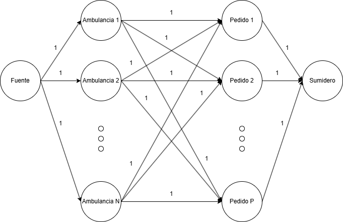

# Red de flujo

¿Cuales con las restricciones del enunciado que deben modelarse?:
1. Tenemos N ambulancias
2. Tenemos P pedidos
3. Cada ambulancia puede asignarse a como maximo 1 pedido

La restriccion de que cada ambulancia no debe trasladarse más de $k$ kilómetros se validara en el algoritmo implementado al momento de crear el grafo que representa la red propuesta. Basicamente si entre una ambulancia y un pedido no hay una distancia menor a $k$, entonces no habra una arista que conecte dicha ambulancia y dicho pedido.

Luego, mediante la red de flujo propuesta podemos ver que cada ambulancia solo puede asignarse como a maximo 1 pedido. 

Por otro lado, el flujo de la red representa los pedidos que fueron solucionados.

Si el flujo que llega al sumidero es igual a la cantidad de pedidos, entonces el problema tiene solucion.