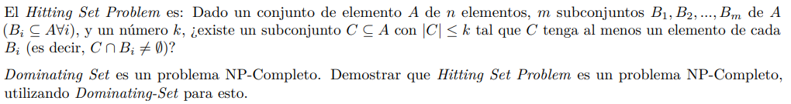

# Enunciado



## Conjuntos

Definiciones:
- A: Conjunto de m subconjuntos $B_i$
- $B_i$: Subconjunto de A
- C: Subconjunto con al menos un elemento de cada $B_i$

## Ejemplo

Ejemplo: Consideramos $k = 3$
- A = [[1,2,3], [4,5,6], [7,8,9]]
- C = [1,4,7]

# Demostracion

Para demostrar que es un problema NP-Completo debemos:
- Demostrar que Hitting Set se encuentra en NP
- Reducir el problema de Dominating Set al problema de Hitting Set: Dominating Set $\leq_P$ Hitting Set

Nota: Para la segunda demostracion es importante demostrar que nuestra reduccion es correcta demostrando
la doble implicacion.

La segunda demostracion nos indica que el problema de Hitting Set es al menos tan dificil de resolver
como el problema de Dominating Set. Esto significa que resolver el problema de Dominating Set puede ser
transformado en resolver Hitting set.

## Demostracion I: El problema se encuentra en NP

Para que el problema se encuentre en NP, debe haber un verificador eficiente.

En otras palabras, debe haber un verificador que ejecute en tiempo polinomial.

Validador: Recorremos el conjunto C y para cada elemento vemos si se encuentra en algun subconjunto de A. Si
alguno de los elementos de C no se encuentra en algun subconjunto de A, entonces devolvemos False.

```
def validador(A, C):

    if len(C) > k:
        return False

    for elemento in C:
        encontrado = False

        for conjunto in A.

            if elemento in A:
                encontrado = True
                break
        
        if not encontrado:
            return False
    
    return True
```

Complejidad: Recorrer el conjunto C tiene en el peor caso una complejidad de O(k). Recorrer el conjunto A
tiene en el peor caso una complejidad de O(n). Luego, la complejidad resulta ser O(k+n).

Luego, se ejecuta en tiempo polinomial, lo cual quiere decir que el problema se encuentra en NP.

## Demostracion II: Reduccion de un problema NP-Completo

Debemos demostrar que Dominating Set $\leq_P$ Hitting Set.

### Reduccion planteada

¿Podemos resolver el problema de Dominating Set utilizando la solucion de Hitting Set?.

Vamos a utilizar una caja negra que resuelve el problema de Hitting Set para resolver el problema de Dominating Set.

El problema de Dominating Set recibe un grafo y un valor $k$.

Transformacion del problema:
- Un elemento $E_i$ por cada vertice $V_i$ del grafo.
- Un subconjunto $B_i$ con los elementos $E_i$ si los vertices $V_i$ a los que representan
son adyacentes en el grafo. Asi tenemos el conjunto A formado por los subconjuntos $B_i$.
- El valor $k'$ del problema de Hitting Set coincide con el valor $k$ recibido por
el problema de Dominating Set.

A continuacion, para demostrar que la reduccion es correcta, debemos demostrar que

Hay solucion de DS de tamaño a lo sumo $k$ si y solo si hay solucion de HS de tamaño a lo sumo $k'$.

Para demostrar ambas implicaciones tenemos dos opciones:
- Metodo directo, asumiendo para cada una que la hipotesis es cierta.
- Metodo por absurdo.

### Si hay DS, entonces hay HS

Si hay un DS de a lo sumo k vertices, implica que todos los vertices estan cubiertos.

Si nosotros decidieramos que los elementos que corresponden a esos mismos vertices pertenezcan
al conjunto C, ya que son a lo sumo k, cumplen con la misma restriccion.

A su vez, como los subconjuntos $B_i$ fueron generados a partir de las aristas del grafo, no puede
suceder que haya elementos en C tal que no pertenezcan a al menos uno de los subconjuntos $B_i$
porque eso implicaria que hay un problema en el grafo original, lo cual es un absurdo.

### Si hay HS, entonces hay DS

SI tenemos un HS de a lo sumo $k'$ elementos, implica que cada uno de sus elementos pertenecen
a al menos uno de los subconjuntos de $B_i$.

Definimos que los vertices a elegir en el DS son los representacos por los $k'$ elementos
que forman el conjunto C. Notamos que no pueden ser mas que el $k$ requerido por DS porque 
anteriormente definimos que $k = k'$. Luego, no puede existir un vertice que no este cubierto 
por esta seleccion.

Yendo por el absurdo, si decimos que existe un vertice no cubierto dada esta seleccion, implica
que el conjunto C no tiene al menos un elemento de cada subconjunto $B_i$. Esto ultimo implicaria 
que la solucion brindada para HS no era correcta, lo cual es un absurdo ya que partimos de esa 
hipotesis. Entonces, necesariamente si hay HS, debe haber DS (todo de tamaño k).

# Conclusion

Habiendo demostrado que la reduccion es correcta, queda demostrado tambien que el problema
de Hitting Set es un problema NP-Completo.