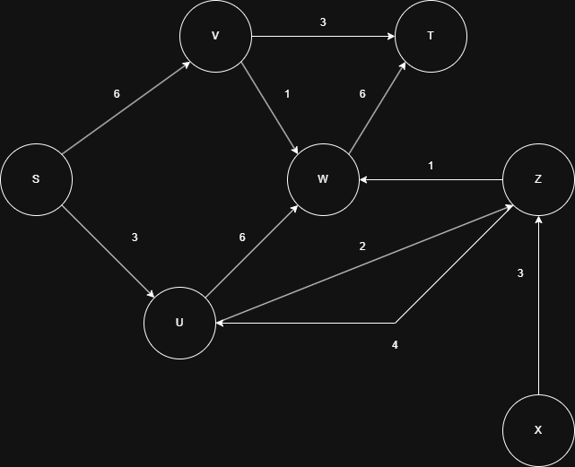
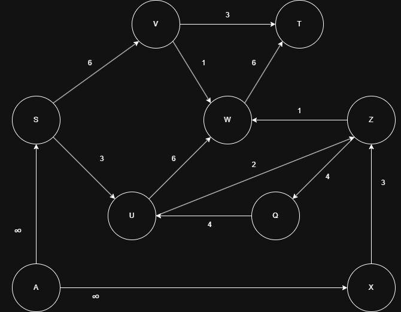
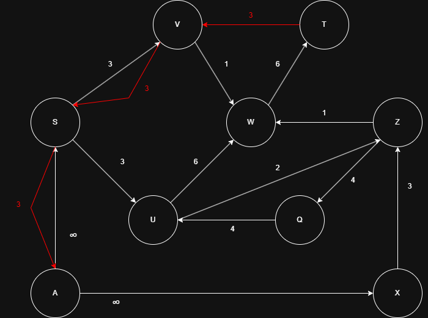
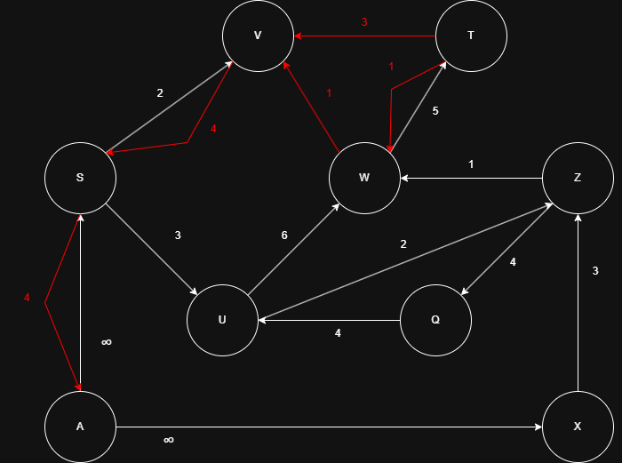
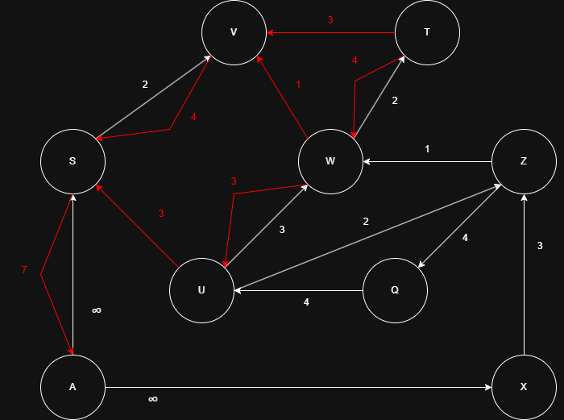
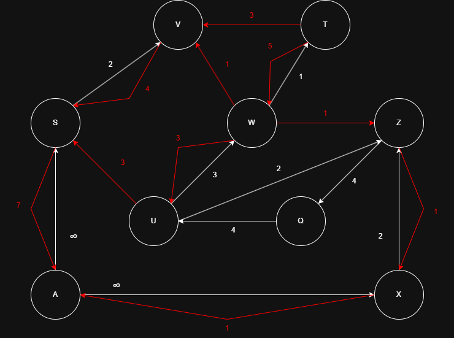
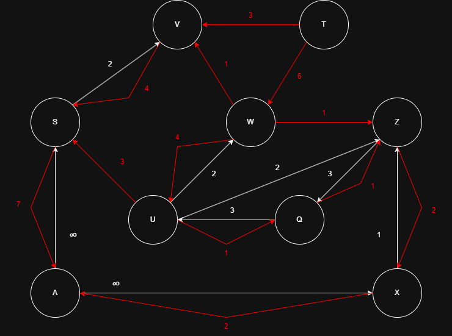
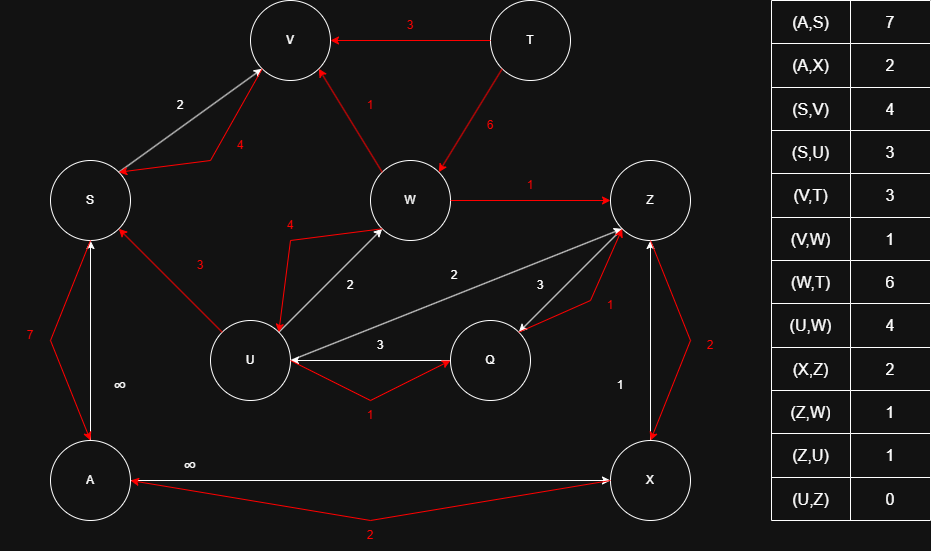

# Enunciado

Hacer un seguimiento de obtener el flujo máximo en la siguiente red de transporte, realizando las modificaciones previas que fueran necesarias. Luego, definir cuáles son los dos conjuntos del corte mínimo en dicha red.

# Solucion

## Restricciones

Es restriccion tener una única fuente. Podemos ver que tenemos dos fuentes (S y X). Agregamos una super fuente (A) con flujo infinito.

Es restriccion tener aristas antiparalelas. Podemos ver que eso sucede entre los vértices U y Z. Eliminamos esta arista antiparalela creando un nuevo vértice N.

## Camino 1: A → S → V → T

BFS minimo: 3

## Camino 2: A → S → V → W → T

BFS minimo: 1

## Camino 3: A → S → U → W → T

BFS minimo: 3

## Camino 4: A → X → Z → W → T

BFS minimo: 1

## Camino 5: A → X → Z → Q → U → W → T

BFS minimo: 1

## Red residual

## Conjuntos del corte mínimo

Desde la fuente, ¿a que vertices podemos llegar mediante un BFS teniendo en cuenta el grafo residual?. ESte sera uno de los conjuntos de corte minimo. EL otro conjunto de corte minimo que incluye al sumidero sera aquel conjunto formado por los vertices a los que no se llego desde la fuente.

Conjunto fuente = [A, S, U, V, W, X, Z]

Conjunto sumidero = [T]
