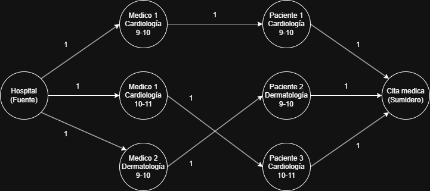

# Enunciado

En un hospital, se tiene un conjunto de médicos y un conjunto de pacientes. Cada médico tiene un horario con franjas horarias disponibles para citas médicas y su área de especialidad, y cada paciente tiene sus franjas horaria disponibles para ir al médico, junto con la información de qué tipo de especialidad requiere. Nuestro objetivo es emparejar médicos con pacientes de manera que se maximice el número total de citas médicas programadas. Se puede asumir que cada visita médica dura una cuota de tiempo fija, y que los pacientes pueden ser a priori atendidos por cualquier médico que coincida con el área de especialidad que requieren. Implementar un algoritmo que resuelva dicho problema de manera eficiente. Indicar y justificar la complejidad del algoritmo implementado.

# Solucion

## Modelado

Modelamos el problema como un problema de Bipartite Matching.

¿Cual es el objetivo?. Maximizar la cantidad de citas posibles entre medicos y pacientes respetando la coincidencia de especialidad y horarios.

¿Como modelamos el problema en una red?:
1. Modelamos cada medico-horario como un vertice
2. Modelamos cada paciente como un vertice
3. Definimos una super fuente S conectada a cada medico-horario con flujo 1
4. Definimos un super sumidero T conectado a cada paciente con flujo 1
5. Conectamos cada medico-horario con cada paciente segùn especialidad coincidente con flujo 1

Nottamos que modelamos cada franja horaria (medico-horario) como un vertice independiente. Esto se debe a que si un medico A tiene 3 franjas horarias $A_1$, $A_2$ y $A_3$ podria antender a 3 pacientes de forma simultanea en distintos momentos.

¿Que circula por la red?. Citas medicas asignadas.

¿Que estamos maximizando?. El flujo total de S a T que representa la cantidad total de citas medicas asignadas respestando las restricciones de coincidencia.

## Ejemplo

