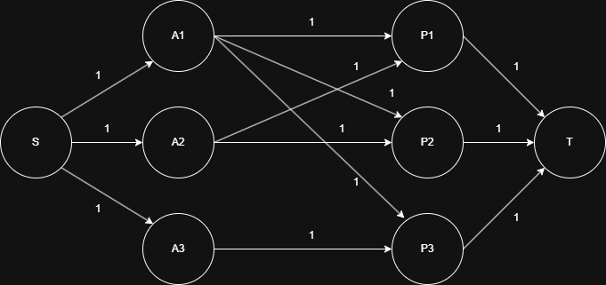

# Enunciado

La Cruz Roja cuenta con n ambulancias, de las cuáles conoce la ubicación de cada una. En un momento dado llegan p pedidos de ambulancias para socorrer personas. Debido a diferentes reglas que tienen, una ambulancia no debe trasladarse más de k kilómetros. Se quiere saber si se puede hacer una asignación de ambulancias a los pedidos, asignando cada una a como máximo 1 pedido. 

Implementar un algoritmo que resuelva este problema, utilizando redes de flujo. 

Indicar y justificar la complejidad del algoritmo implementado para el problema planteado.

# Solucion

## Modelado

Modelamos el problema como un problema de Bipartite Matching.

¿Cual es el objetivo?. Maximizar la cantidad de asignaciones de ambulancias y personas, con la restriccion de asignar cada una a como maximo 1 persona.

¿Como modelamos el problema en una red?:
1. Modelamos cada ambulancia como un vertice
2. Modelamos cada persona como un vertice
3. Definimos una super fuente S conectada a cada ambulancia con flujo 1
4. Definimos un super sumidero T conectado a cada persona con flujo 1
5. Conectamos cada ambulancia con cada persona con flujo 1

La restriccion de que cada ambulancia no debe trasladarse más de $k$ kilómetros se validara en el algoritmo implementado al momento de crear el grafo que representa la red propuesta. Basicamente si entre una ambulancia y un pedido no hay una distancia menor a $k$, entonces no habra una arista que conecte dicha ambulancia y dicho pedido.

¿Que circula por la red?. Pedidos asignados.

¿Que estamos maximizando?. El flujo total de S a T que representa la cantidad total de pedidos asignados respestando las restricciones de asinar cada ambulancia a 1 persona como maximo.

## Ejemplo

