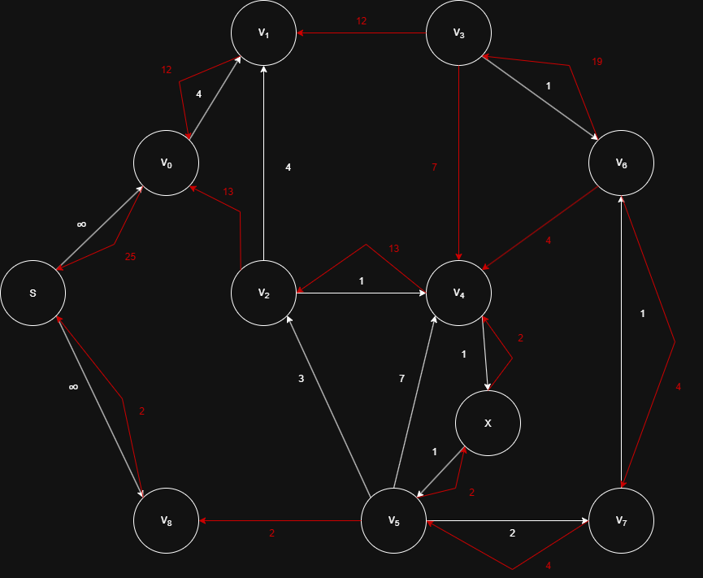

# Enunciado

Realizar el seguimiento de aplicar el algoritmo de Ford-Fulkerson a la red del dorso, explicando (en caso de ser necesario) cuáles son las modificaciones previas a realizarle. 

Luego de realizar dicho seguimiento, suponer que se agrega una arista del vértice v2 al vértice v3 de capacidad 9 y una arista de v0 a v2 de capacidad 2. Trabajando sobre la red residual resultante del seguimiento previo, continuar el seguimiento con este agregado. 

Dar el resultado final del flujo, considerando la red original (incluyendo el agregado de la arista mencionada, pero sin las modificaciones que hayas hecho inicialmente).

# Solucion

## Seguimiento 1

### Restricciones

Restricciones:
1. No pueden haber ciclos de dos vertices (aristas antiparalelas): Agregamos un vertice ficticio intermedio X entre V4 y V5.
2. Solo hay una fuente: Agregamos una super fuente S conectada a $V_0$ y $V_8$.

### Camino 1: S → V0 → V1 → V3 → V6

### Camino 2: S → V8 → V5 → V7 → V6

### Camino 3: S → V0 → V2 → V4 → V6

### Camino 4: S → V0 → V2 → V4 → V3 → V6

### Camino 5: S → V0 → V2 → V4 → X → V5 → V7 → V6

### Red residual

## Seguimiento 2

### Modificaciones

### Camino 1: S → V0 → V2 → V3 → V6

### Camino 2: S → V0 → V2 → V4 → X → V5 → V7 → V6

### Red residual

## Flujo final

