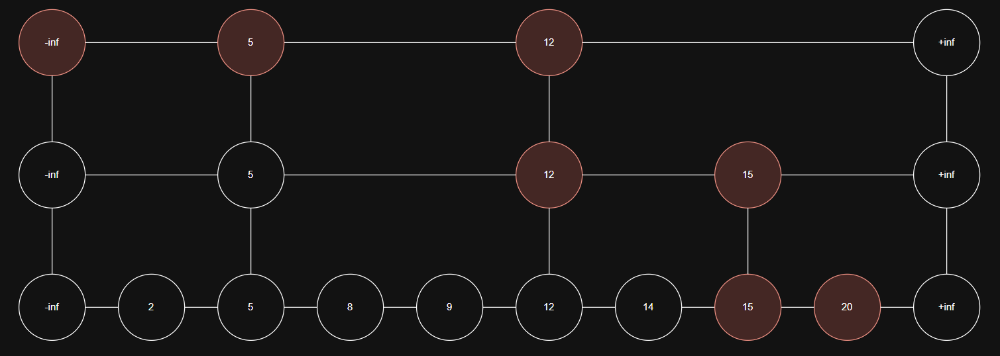

# Enunciado

Realizar un seguimiento al operar con una Skip List (inicialmente vacía) para agregar los siguientes elementos: 8, 12, 20, 15, 5, 2, 9, 14. 

Cuando se necesiten resultados aleatorios, se puede utilizar la siguiente secuencia: 0 1 1 0 0 1 0 1 1 0 0 0 0 1 0 1 1 1 1 0 0 0 0 0 1 1 0 0 1 0 1 1 0. 

Luego mostrar un seguimiento de las busquedas de: 18, 9, 2.

Seguimiento: https://cmps-people.ok.ubc.ca/ylucet/DS/SkipList.html

# Solucion

## Inserciones

### Insertar 8

Como la lista está vacía, se busca la posición correspondiente para el número 8.

En el nivel 0, se parte desde -∞ y como +∞ es el único elemento que lo sigue, se lo inserta entre ambos.

Se lanza una moneda (primer bit de la secuencia aleatoria es 0), por lo tanto 8 se inserta solo en el nivel 0.

### Insertar 12

Se comienza desde el nivel más alto actual (nivel 0). 

Desde -∞ se va a 8 y luego a +∞, pero 12 es mayor que 8. Por lo tanto, se inserta después del 8.

Luego, se lanza una moneda: 1 (sube al nivel 1), luego otra: 1 (sube al nivel 2), y una más: 0 (se detiene).

Por lo tanto, el número 12 se inserta en los niveles 0, 1 y 2.

### Insertar 20

Se inicia desde el nivel más alto (nivel 2). 

Desde -∞ se va a 12, luego a +∞.

Como 20 > 12 y no hay más nodos en ese nivel, se baja a nivel 1, repitiendo el recorrido.

Nuevamente desde 12 se va a +∞, por lo tanto se baja a nivel 0.

Allí se llega a 12, se continúa hacia +∞, y se inserta después de 12.

Se lanza una moneda: 0, por lo que 20 se inserta solo en nivel 0.

### Insertar 15

Desde el nivel 2 se va de -∞ a 12. Como 15 > 12 pero no hay más nodos, se baja a nivel 1.

En nivel 1, desde 12 se va a +∞, se baja a nivel 0.

En nivel 0, se va desde 12 a 20. Como 15 < 20, se inserta entre 12 y 20.

La secuencia aleatoria da 1 (sube), luego 0 (se detiene), por lo que se inserta en niveles 0 y 1.

### Insertar 5

Desde el nivel 2 se va desde -∞ a 12. 

Como 5 < 12, se baja a nivel 1.

En nivel 1 se va de -∞ a 12 nuevamente, pero como 5 < 12, se baja al nivel 0.

En nivel 0 se va de -∞ a 8, pero 5 < 8, por lo tanto se inserta entre -∞ y 8.

Se lanzan tres monedas: 1, 1, 0 con lo cual se inserta en niveles 0, 1 y 2.

### Insertar 2

Desde el nivel 2, se va de -∞ a 5. Como 2 < 5, se baja a nivel 1.

En nivel 1, de -∞ a 5 nuevamente, y se vuelve a bajar a nivel 0.

Allí se va desde -∞ a 5, pero 2 < 5, por lo tanto se inserta entre -∞ y 5.

La moneda da 0, por lo tanto se inserta solo en nivel 0.

### Insertar 9

Desde nivel 2 se va de -∞ a 5, luego a 12. Como 9 < 12, se baja a nivel 1.

Desde 5 en nivel 1 se va a 12 nuevamente, y como 9 < 12, se baja al nivel 0.

En nivel 0 se va de 5 a 8, y luego a 12. Como 9 < 12 pero > 8, se inserta entre 8 y 12.

La moneda da 0, por lo tanto se inserta solo en nivel 0.

### Insertar 14

Desde nivel 2 se va de -∞ a 5, luego a 12. Como 14 > 12 y no hay más nodos, se baja a nivel 1.

En nivel 1 se va desde 12 a 15. Como 14 < 15, se baja a nivel 0.

En nivel 0 se va desde 12 a 15, y se inserta entre ellos.

La moneda da 0, por lo tanto se inserta solo en nivel 0.

## Búsquedas

### Buscar 18

Desde el nivel 2 se va de -∞ a 5, luego a 12. Como 18 > 12 y no hay más nodos, se baja a nivel 1.

En nivel 1 se va de 12 a 15. Como 18 > 15 y no hay más nodos, se baja a nivel 0.

En nivel 0 se va desde 15 a 20. Como 18 < 20, y no está antes, no se encuentra el valor.

### Buscar 9

Desde el nivel 2 se va de -∞ a 5, luego a 12. Como 9 < 12, se baja a nivel 1.

En nivel 1 se va desde 5 a 12 nuevamente, y como 9 < 12, se baja a nivel 0.

En nivel 0 se va desde 5 a 8, luego a 9. Se encuentra el valor exactamente en esa posición.

### Buscar 2

Desde el nivel 2 se va de -∞ a 5. Como 2 < 5, se baja a nivel 1.

En nivel 1 se repite el recorrido de -∞ a 5 y se baja a nivel 0.

En nivel 0 se va desde -∞ a 2. Se encuentra el valor exactamente en esa posición.

