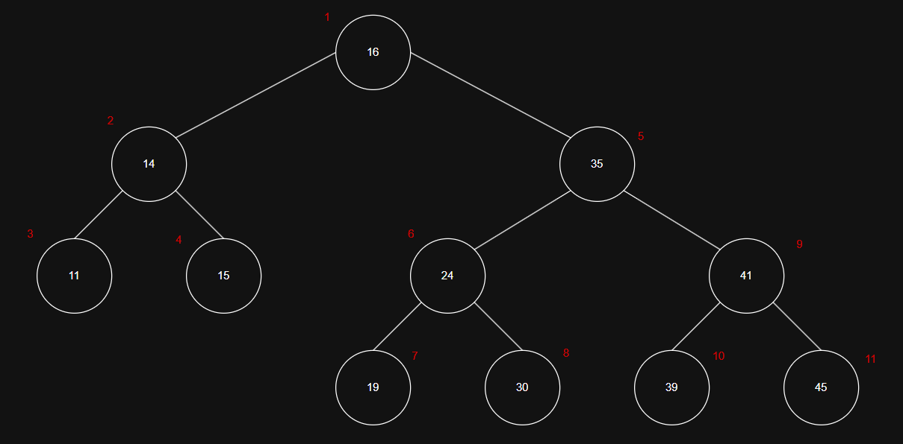

# Enunciado

a. Hacer un seguimiento del algoritmo de Quicksort, con seleccion aleatoria de pivot, para ordenar los siguientes elementos: 45, 14, 24, 35, 16, 11, 30, 15, 39, 19, 41. Para las selecciones aleatorias de pivot, considerar que el primer elemento elegido es el 16. Para las siguientes selecciones aleatorias tuvimos "suerte", siempre se selecciono el valor de la mediana en cada caso.

b. Indicar la complejidad temporal esperada de Quicksort

c. Mostrar un ABB que, si se lo construye apropiadamente, realiza las mismas comparaciones que el seguimiento de Quicksort detallado anteriormente. Indicar de que manera se construyo el arbol.

d. Indicar cuales serian las peores selcciones de pivot e indicar en que complejidad temporal resultaria.

# Solucion

## Item a

Elementos: [45, 14, 24, 35, 16, 11, 30, 15, 39, 19, 41]

Primer pivote: 16

Siempre elegimos la mediana en cada subproblema.

### Paso 1

Partición:
- Menores: 14, 11, 15
- Pivote = 16
- Mayores: 45, 24, 35, 30, 39, 19, 41

Resultado parcial: [ 14 11 15 ] 16 [ 45 24 35 30 39 19 41 ]

### Paso 2: Subproblema izquierdo

Elementos: [14, 11, 15]

Tamaño 3, entonces la mediana es 14

Partición:
- Menores: 11
- Pivote = 14
- Mayores: 15

Resultado parcial: [ 11 ] 14 [ 15 ]

### Paso 3: Subproblema derecho

Elementos: [45, 24, 35, 30, 39, 19, 41]

Tamaño 7, entonces la mediana es 35 (de 7 valores ordenados sería el cuarto valor)

Elementos ordeanos: [19, 24, 30, 35, 39, 41, 45]

Partición:
- Menores: 24,30,19
- Pivote = 35
- Mayores: 45,39,41

Resultado parcial: [ 24 30 19 ] 35 [ 45 39 41 ]

### Paso 4: Subproblema izquierdo

Elementos: [24, 30, 19]

Tamaño 3, entonces la mediana es 24

Partición:
- Menores: 19
- Pivote = 24
- Mayores: 30

Resultado parcial: [ 19 ] 24 [ 30 ]

### Paso 5: Subproblema derecho

Elementos: [45, 39, 41]

Tamaño 3, entonces la mediana es 41

Partición:
- Menores: 39
- Pivote = 41
- Mayores: 45

Resultado parcial: [ 39 ] 41 [ 45 ]

### Paso 6: Ensamble

Combinando las divisiones:
- Izquierda total: 11 14 15
- Pivote raíz inicial: 16
- Derecha: 19 24 30 35 39 41 45

Resultado final: [11, 14, 15, 16, 19, 24, 30, 35, 39, 41, 45]

## Item b

Cada partición divide el problema en partes más pequeñas.

Si el pivote es elegido al azar, en promedio reduce el tamaño del problema a la mitad.

Cada nivel de recursión procesa O(n) comparaciones en total.

El número esperado de niveles es O(log n).

Por lo tanto, la complejidad temporal esperada es: O(n log (n))

## Item c

Para construirlo se debe insertar en el ABB en el mismo orden en que Quicksort elige sus pivotes.

## Item d

El peor caso seria elegir siempre el mínimo o el máximo elemento como pivote. Esto genera particiones de tamaño n−1 y 0.

Como resultado de esto la recursión no se balancea y la profundidad del árbol de recursión es O(n).

Esto quiere decir que cada nivel hace O(n) comparaciones.

Luego, la complejidad en el peor caso resultaria ser O(n²).
